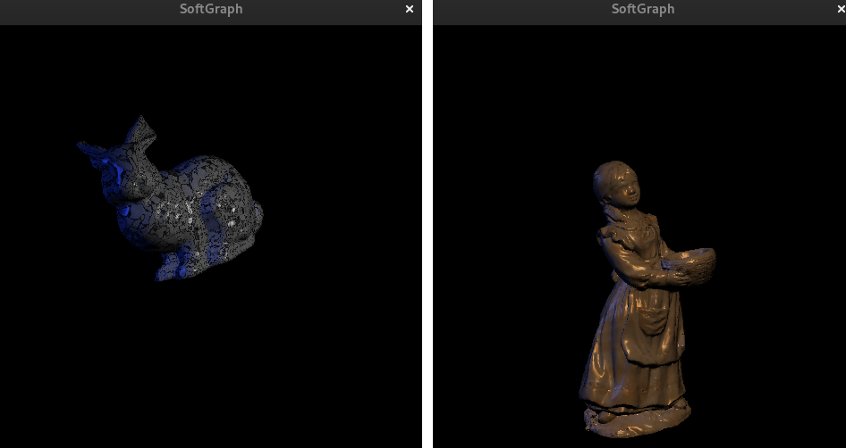

# SoftGfx

**SoftGfx** is a very simple 3D software rendering library, it's similar to Classic OpenGL and supports 4x4 matrix manipulation, OBJ mesh drawing, Gouraud/Phong lighting up to 8 lights, texture mapping with one texture, bilinear filtering, texture perspective correction, mesh materials, Z-buffer, BMP texture loading.

## Build sample

To build you must have the SDL2 development files installed, the simple Makefile included builds the sample application with the ```make``` command (it's source is found in src/simple_app.c). The sample program opens and shows one of two OBJ files with one of two BMP textures applied. 



## Sample controls

+ **Arrow Keys** - Rotates the model
+ **P** - Toggle the projection matrix (ortjogonal or perspective). 
+ **L** - Turns on/off the second blue light.
+ **K** - Toggle between both baked materials.
+ **M** - Toggle the mesh shown.
+ **T** - Toggle between both loaded textures.
+ **C** - Moves the camera to three baked positions.


